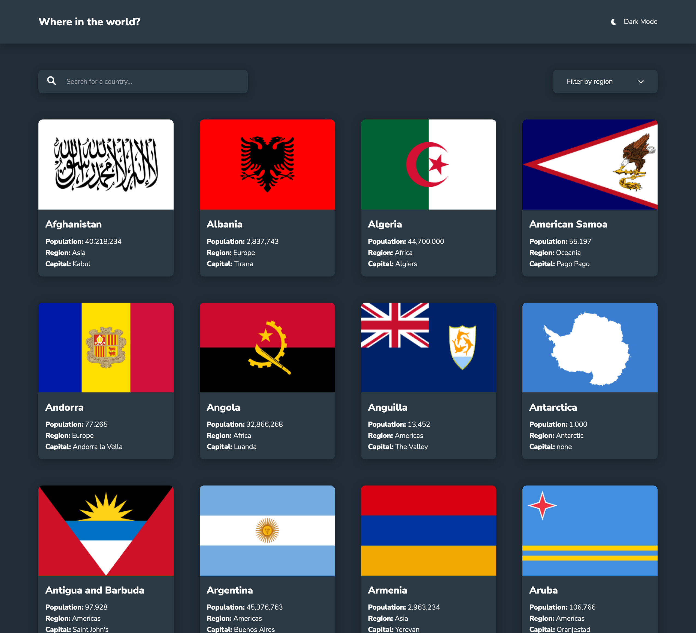

# Frontend Mentor - REST Countries API with color theme switcher solution

This is a solution to the [REST Countries API with color theme switcher challenge on Frontend Mentor](https://www.frontendmentor.io/challenges/rest-countries-api-with-color-theme-switcher-5cacc469fec04111f7b848ca). Frontend Mentor challenges help you improve your coding skills by building realistic projects.

## Overview

### The challenge

Users should be able to:

- See all countries from the API on the homepage
- Search for a country using an `input` field
- Filter countries by region
- Click on a country to see more detailed information on a separate page
- Click through to the border countries on the detail page
- Toggle the color scheme between light and dark mode _(optional)_

### Screenshot

### Links

- [Live Site](https://unique-parfait-6dbfc1.netlify.app/)

## My process

### Built with

- Vue3
- SASS

### What I learned

This project help me get better with CSS, plus gave me an opportunity to get hands-on experience with Vue's composition API.

### Continued development

Need to learn more about Semantic HTML

## Author

- Frontend Mentor - [@lipe11](https://www.frontendmentor.io/profile/lipe11)
